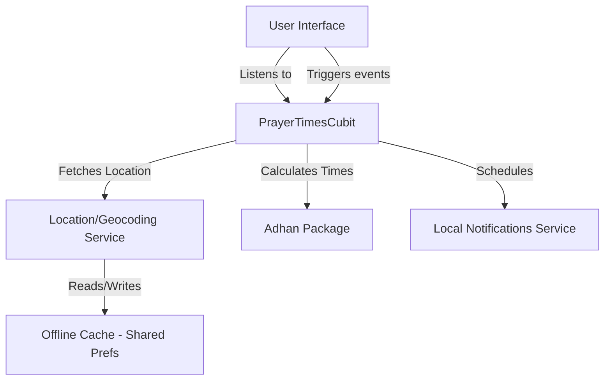
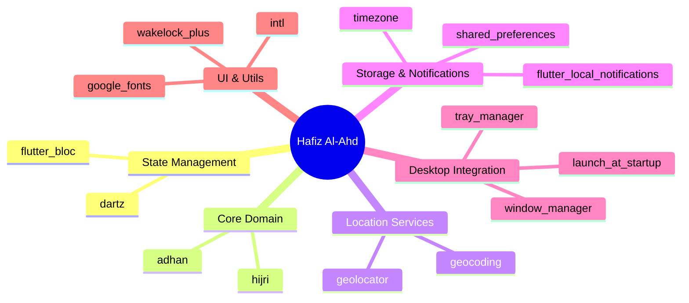

# Hafiz Al-Ahd - Comprehensive Developer Documentation

## 1. Project Overview
**Hafiz Al-Ahd** is a comprehensive, elegant, and practical Flutter application designed to display prayer times, Islamic (Hijri) and Gregorian dates, and local notifications for Muslims. It is built with a responsive design to support multiple screen sizes including mobile, tablet, and desktop (specifically optimized for Windows).

## 2. Architecture & State Management
The application follows a clean, highly decoupled architecture utilizing the **Cubit** pattern (a lightweight version of Bloc) for State Management.
- **PrayerTimesCubit**: The core state manager that orchestrates calculating prayer times, interacting with location services, and handling the logic behind notifications.
- **Location Service**: Responsible for fetching GPS coordinates or falling back to manually selected locations (cached locally for offline access).
- **Notification Service**: Schedules and triggers local notifications for Adhan in the background.

## 3. Core Features
- **Responsive UI**: Custom adaptive layouts for different devices.
- **Precise Prayer Times Calculation**: Offline calculation of prayer times based on exact GPS coordinates without relying on internet APIs.
- **Accurate Islamic Calendar**: Hijri date calculation corresponding to the calculated prayer times.
- **Desktop Automation**: Windows system tray integration, window management (hiding/resizing), and launch at startup functionality.
- **Offline Reliability**: Saves user location and settings locally to reduce network/GPS dependencies.
- **Local Notifications**: Background alerts scheduled precisely for prayer times.

## 4. Comprehensive Dependencies Illustration

The application relies on several carefully chosen Flutter packages. Below is a detailed breakdown of each dependency and its role in the application:

### State Management & Architecture
*   **`flutter_bloc` / `bloc` (v9.1.x)**: The core state management solution. It separates business logic from the UI, making the app reactive, testable, and scalable.
*   **`dartz` (v0.10.1)**: Used for functional programming in Dart. It provides constructs like `Either` which helps in elegant error handling (e.g., gracefully handling network or location errors without crashing).

### Islamic Core Domain
*   **`adhan` (v2.0.0+1)**: A highly accurate, offline prayer times calculation library. It implements various calculation parameters (Muslim World League, Egyptian, Umm Al-Qura, etc.).
*   **`hijri` (v3.0.0)**: Used to calculate, adjust, and display the Islamic Hijri calendar accurately based on the Gregorian date.

### Location & Device Capabilities
*   **`geolocator` (v14.0.2)**: Interfaces with native platform APIs to retrieve the user's current exact GPS location (latitude and longitude).
*   **`geocoding` (v4.0.0)**: Translates raw coordinates into human-readable addresses (e.g., City and Country names) to display in the UI.

### System & Background Utilities
*   **`shared_preferences` (v2.5.4)**: Maintains persistent key-value storage. Used to preserve user settings, caching the latest location, and maintaining offline state locally.
*   **`intl` (v0.20.2)**: Provides crucial internationalization and localization support, heavily used for formatting dates and times correctly based on the system locale.
*   **`wakelock_plus` (v1.4.0)**: Keeps the device screen awake. This is specifically useful when the user is reading Adhkar (supplications) or waiting for the prayer time without the screen turning off.
*   **`flutter_local_notifications` (v21.0.0) / `timezone` (v0.11.0)**: Required for scheduling and delivering offline alerts and sounding the Adhan precisely when prayer times occur.

### Desktop & Windows Specific
*   **`window_manager` (v0.4.3)**: Allows the app to control its window dimensions, position, and visibility to provide a native desktop feel.
*   **`tray_manager` (v0.2.2)**: Puts the app icon in the system tray (bottom right corner on Windows) allowing it to run silently in the background.
*   **`launch_at_startup` (v0.5.1)**: Enables the app to register with the OS to start automatically when the user turns on their Windows PC.
*   **`package_info_plus` (v9.0.0)**: Used alongside desktop packages to fetch the app name/version dynamically for system-level registries.

### UI & Aesthetics
*   **`cupertino_icons` / `google_fonts`**: Provides high-quality iconography and standard typography alongside the customized Arabic fonts (Thuluth/Kufi) available in the project assets.

## 5. Directory Structure Map
- `lib/`: Contains the main Dart source code orchestrating UI, Cubits, and Services.
- `assets/images/`: Contains logos, launcher icons, and splash UI assets.
- `assets/fonts/`: Houses elegant Arabic fonts like Thuluth and Kufi required for UI rendering.
- `android/` / `ios/` / `windows/` / `linux/` / `macos/` / `web/`: Platform-specific configuration files (Info.plist, AndroidManifest.xml, etc.).
