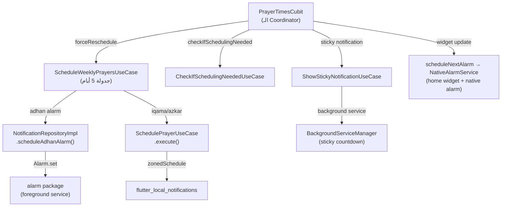

# 📡 توثيق شامل لنظام الإشعارات في تطبيق "حافظ العهد"

## 1. نظرة عامة (Architecture Overview)

نظام الإشعارات يتكون من **4 طبقات** رئيسية تتعاون معاً لضمان وصول الأذان والإقامة والأذكار للمستخدم في الوقت الدقيق:



---

## 2. أنواع الإشعارات (Notification Types)

| النوع | الآلية | الأهمية | الصوت | التفاصيل |
|---|---|---|---|---|
| **🔊 الأذان** | `alarm` package (Foreground Service) | `fullScreenIntent: true` | `adhan.mp3` / `fajr_azan.mp3` | يفتح `AdhanScreen` بشاشة كاملة، محمي من الإغلاق، `ongoing: true` |
| **🕌 الإقامة** | `flutter_local_notifications` (`zonedSchedule`) | `Importance.max` | `iqama_sound` | إشعار عادي يختفي بعد 30 دقيقة |
| **📿 تذكير أذكار الصباح** | `flutter_local_notifications` (`zonedSchedule`) | `Importance.max` | بدون صوت مخصص | بعد الفجر بـ 30 دقيقة، payload: `azkar_morning` |
| **📿 تذكير أذكار المساء** | `flutter_local_notifications` (`zonedSchedule`) | `Importance.max` | بدون صوت مخصص | بعد العصر بـ 30 دقيقة، payload: `azkar_evening` |
| **📿 تذكير أذكار بعد الصلاة** | `flutter_local_notifications` (`zonedSchedule`) | `Importance.max` | بدون صوت مخصص | بعد الإقامة بـ 5 دقائق (أو بعد الأذان بـ 25 دقيقة)، payload: `azkar_after_prayer` |
| **⏰ العداد الثابت (Sticky)** | `flutter_background_service` (Foreground Service) | `Importance.low` | بدون صوت | يعرض عد تنازلي دائم، `ongoing: true`, ID: `8888` |

---

## 3. دورة حياة الجدولة (Scheduling Lifecycle)

### 3.1 أول تشغيل / فتح التطبيق

```
main.dart → di.init() → notificationRepository.initialize()
→ App() → PrayerTimesCubit.fetchPrayerTimesByLocation()
→ _handleFetchResult() → _updateStickyCountdown()
→ _checkBackgroundScheduling()
→ CheckIfSchedulingNeededUseCase.execute()
→ ScheduleWeeklyPrayersUseCase.execute(lat, lng, city)
    → cancelAllNotificationsUseCase.execute()  ⚠️ يمسح الكل ثم يجدول من جديد
    → for 5 days: _schedulePrayersForDay()
        → scheduleAdhanAlarm() × 5 prayers/day
        → schedulePrayerNotification() for iqama × 5/day
        → schedulePrayerNotification() for azkar × 5/day
    → pref.setString('scheduled_until_date', ...)
```

### 3.2 إعادة الجدولة اليدوية (زرار تحديث / تغيير إعدادات)

```
SettingsScreen._saveSettings()
→ pref.remove('scheduled_until_date')
→ PrayerTimesCubit.forceReschedule()
    → cancelAllNotificationsUseCase.execute()
    → scheduleWeeklyPrayersUseCase.execute(lat, lng, city)
    → restoreStickyNotificationIfNeeded()
```

### 3.3 التحديث التلقائي في الخلفية

```
scheduleNextAlarm()
→ NativeAlarmService.scheduleNativeSyncAlarm()  ← يحدث الويدجت والإشعار الثابت
→ AndroidAlarmManager.oneShotAt()               ← يوقظ Dart بعد كل صلاة
    → backgroundPrayerUpdater()                 ← يحسب الصلاة التالية ويجدول من جديد
```

---

## 4. تفصيل الملفات والأدوار

### الملفات الرئيسية

| الملف | الدور |
|---|---|
| [`base_notification_repository.dart`](lib/features/notifications/domain/repos/base_notification_repository.dart) | الـ Abstract Interface لكل عمليات الإشعارات |
| [`notification_repository_impl.dart`](lib/features/notifications/data/repos/notification_repository_impl.dart) | التطبيق الفعلي: `zonedSchedule`, `Alarm.set`, sticky |
| [`schedule_weekly_prayers_usecase.dart`](lib/features/notifications/domain/usecases/schedule_weekly_prayers_usecase.dart) | جدولة 5 أيام كاملة: أذان + إقامة + أذكار |
| [`schedule_prayer_usecase.dart`](lib/features/notifications/domain/usecases/schedule_prayer_usecase.dart) | جدولة إشعار واحد (wrapper بسيط) |
| [`cancel_all_notfication_usecase.dart`](lib/features/notifications/domain/usecases/cancel_all_notfication_usecase.dart) | مسح كل الإشعارات + كل المنبهات |
| [`check_if_scheduling_needed_usecase.dart`](lib/features/notifications/domain/usecases/check_if_scheduling_needed_usecase.dart) | هل نحتاج إعادة جدولة؟ (لو فاضل أقل من يومين) |
| [`check_location_change_usecase.dart`](lib/features/notifications/domain/usecases/check_location_change_usecase.dart) | هل الموقع اتغير أكثر من 10 كم؟ |
| [`show_sticky_notification_usecase.dart`](lib/features/notifications/domain/usecases/show_sticky_notification_usecase.dart) | عرض العداد الثابت |
| [`adhan_screen.dart`](lib/features/notifications/presentation/screens/adhan_screen.dart) | شاشة الأذان بملء الشاشة مع Slider Button |
| [`background_service_manager.dart`](lib/core/services/background_service_manager.dart) | إعداد Foreground Service للعداد الثابت |
| [`native_alarm_service.dart`](lib/core/services/native_alarm_service.dart) | Method Channel لجدولة Exact Alarm في Native Android |
| [`home_widget_helper.dart`](lib/core/utils/home_widget_helper.dart) | تحديث الويدجت الخارجية + `backgroundPrayerUpdater` |
| [`prayer_times_cubit.dart`](lib/features/home/presentation/cubit/prayer_times_cubit/prayer_times_cubit.dart) | الـ Coordinator الرئيسي |
| [`main.dart`](lib/main.dart) | Stream listener + alarm listener + deep linking |

---

## 5. نظام الـ Payload والتوجيه (Payload Routing)

### خريطة الـ Payload

| البادئة (Prefix) | المصدر | الإجراء عند الضغط |
|---|---|---|
| `adhan_{id}_{title}` | أذان (alarm/notification) | فتح `AdhanScreen` |
| `iqama_{id}_{title}` | إقامة | **لا شيء** (يُتجاهل) |
| `azkar_morning` | تذكير أذكار الصباح | فتح `MainScreen(initialTab: 2)` |
| `azkar_evening` | تذكير أذكار المساء | فتح `MainScreen(initialTab: 2)` |
| `azkar_after_prayer` | تذكير أذكار بعد الصلاة | فتح `MainScreen(initialTab: 2)` |
| `sticky` | الإشعار الثابت | **لا شيء** (يُتجاهل) |

### مسار التوجيه في `main.dart`

```dart
// من الإشعارات العادية:
selectNotificationStream.stream.listen((payload) {
  if (payload.startsWith('adhan_')) → _openAdhanScreen()
  if (payload.startsWith('azkar_')) → navigate to Azkar tab
});

// من باكيدج alarm (الأذان الحقيقي):
Alarm.ringing.listen((alarmSet) {
  → _openAdhanScreen(notificationId, prayerName)
});

// عند فتح التطبيق من إشعار (cold start):
getNotificationAppLaunchDetails() → _openAdhanScreen()
```

---

## 6. نظام الأصوات

| الملف | الاستخدام | النوع |
|---|---|---|
| `assets/sounds/adhan.mp3` | أذان الصلوات العادية | `alarm` package |
| `assets/sounds/fajr_azan.mp3` | أذان الفجر | `alarm` package |
| `iqama_sound` (raw resource) | صوت الإقامة | `flutter_local_notifications` |

### التحكم في الصوت

- **مستوى الصوت:** `SharedPreferences('adhan_volume')` → `VolumeSettings.fade(volume: x)` 
- **الاهتزاز:** `SharedPreferences('isAdhanVibrationEnabled')` → `AlarmSettings.vibrate`
- لو الصوت = `0.0`: يستخدم `VolumeSettings.fade(volume: 0.0, fadeDuration: 1ms)` لكتمه بالكامل

---

## 7. نظام التعرّف الذكي (Smart Scheduling Gate)

```dart
// CheckIfSchedulingNeededUseCase
if (scheduledUntil - now > 2 days) → return false (تخطي)
else → return true (يجب إعادة الجدولة)
```

يتم حفظ تاريخ آخر جدولة في: `SharedPreferences('scheduled_until_date')`.

عند تغيير أي إعداد (إقامة، صوت، اهتزاز، DST)، يتم مسح هذا المفتاح:
```dart
await prefs.remove('scheduled_until_date');
```
ثم استدعاء `forceReschedule()` لإعادة بناء كل الجدول.

---

## 8. شاشة الأذان (`AdhanScreen`)

### دورة الحياة

1. **`initState`**: بدء مراقبة الـ Lifecycle + تايمر فحص الإيقاف الخارجي كل 2 ثانية.
2. **`_fetchRingingAlarmData`**: جلب مسار الصوت من المنبه الشغال وحساب مدة التشغيل ديناميكياً.
3. **`_setupDynamicCloseTimer`**: يستخدم `audioplayers` لقراءة المدة الفعلية → يُغلق الشاشة تلقائياً بعد انتهاء الأذان + 5 ثواني.
4. **`_closeScreen`**: يوقف المنبه → يُغلق الـ Activity بالكامل (`SystemNavigator.pop()`).

### آليات الإغلاق

| الآلية | التفاصيل |
|---|---|
| **سحب الـ Slider** | يستدعي `_closeScreen()` |
| **زرار الباور / الهوم** | `didChangeAppLifecycleState(paused/hidden)` → `_closeScreen()` |
| **الإيقاف من الإشعار** | تايمر كل 2 ثانية يفحص `Alarm.isRinging()` → يُغلق لو مفيش أذان شغال |
| **انتهاء الصوت تلقائياً** | `_autoCloseTimer` يُغلق بعد مدة الصوت + 5 ثواني |
| **زرار الرجوع** | `PopScope(canPop: false)` → يستدعي `_closeScreen()` |

---

## 9. 🐛 الثغرات والأخطاء المحتملة (Potential Bugs)

### ⚠️ خطورة عالية (Critical)

#### BUG-1: تضارب الـ Notification ID
**الملف:** `schedule_weekly_prayers_usecase.dart` L32
```dart
int notificationId = 1; // يبدأ من 1 كل مرة
```
**المشكلة:** كل مرة يتم فيها `execute()` (إعادة جدولة)، يبدأ العداد من `1` من جديد. هذا يعني:
- لو المستخدم غير إعداد (ضغط "حفظ")، سيتم `cancelAll()` ثم إعادة الجدولة من `id=1`.
- **ولكن** لو `cancelAll()` فشل جزئياً (مثلاً alarm package لم يمسح منبه معين)، سيحصل تضارب بين المنبه القديم والجديد بنفس الـ ID.
- الـ Alarm package يعتبر نفس الـ ID = تحديث (overwrite)، وهذا قد يكون آمناً في بعض الحالات لكنه قد يسبب مشاكل لو كانت المدة مختلفة.

**الحل المقترح:** استخدام `notificationId` يعتمد على التاريخ + رقم الصلاة لضمان التفرد:
```dart
int notificationId = (date.day * 100) + (prayerIndex * 10) + typeIndex;
```

---

#### BUG-15: 🔴 تراكم الأذانات عند فتح الهاتف بعد إغلاق طويل (Stacked Adhans on Wake-up)
**الملف:** `schedule_weekly_prayers_usecase.dart` + `alarm` package behavior
**السيناريو:**
1. المستخدم يغلق هاتفه (إيقاف تام أو وضعه في الطيران لفترة طويلة).
2. تمر عليه أوقات صلوات متعددة (مثلاً الظهر + العصر + المغرب).
3. عند تشغيل الهاتف، يجد باكيدج `alarm` أن هناك 3 منبهات كان المفترض تنفيذها، فيقوم بإطلاقها **جميعاً في نفس اللحظة**.
4. النتيجة: 3 أذانات تعمل فوق بعض في نفس الوقت + محاولة فتح `AdhanScreen` 3 مرات (الأولى فقط ستنجح بسبب `_isAdhanScreenActive` guard).

**السبب الجذري:**
```dart
// في scheduleAdhanAlarm:
final alarmSettings = AlarmSettings(
  id: id,
  dateTime: scheduledTime,  // ⚠️ هذا الوقت فات بالفعل
  // ...
);
await Alarm.set(alarmSettings: alarmSettings);
```
باكيدج `alarm` لا يتحقق مما إذا كان الوقت المجدول قد فات. عند إعادة تشغيل الهاتف، يطلق كل المنبهات التي فات وقتها دفعة واحدة (fire-on-boot behavior).

**المشكلة المركّبة:**
- حتى لو `_isAdhanScreenActive` يمنع فتح شاشة ثانية، **الأصوات** تعمل جميعها في الخلفية لأن باكيدج `alarm` يشغل كل منبه كـ foreground service مستقل.
- `AdhanScreen._closeScreen()` ستوقف المنبه الأول فقط (بالـ ID الخاص به)، بينما الباقي يستمر في التشغيل.
- لو وصل للـ fallback `Alarm.stopAll()` سيوقف الكل لكن أيضاً سيوقف المنبهات المستقبلية المجدولة.

**الحل المقترح (متعدد الطبقات):**
1. **عند فتح التطبيق** (`main.dart` L150-160): بدلاً من فتح أول أذان فقط، يجب إيقاف كل المنبهات التي فات وقتها وفتح شاشة للأذان الأحدث فقط:
```dart
final alarms = await Alarm.getAlarms();
AlarmSettings? latestRinging;
for (final alarm in alarms) {
  if (await Alarm.isRinging(alarm.id)) {
    // أوقف كل اللي قبله واحتفظ بالأخير فقط
    if (latestRinging != null) {
      await Alarm.stop(latestRinging.id);
    }
    latestRinging = alarm;
  }
}
if (latestRinging != null) {
  _openAdhanScreen(
    payload: 'adhan_${latestRinging.id}',
    notificationId: latestRinging.id,
    prayerName: latestRinging.notificationSettings.title,
  );
}
```
2. **عند الجدولة** (`scheduleAdhanAlarm`): إضافة guard إضافي يتحقق من أن الوقت المجدول في المستقبل **بفارق معقول** (مثلاً أكثر من دقيقة):
```dart
if (scheduledTime.difference(DateTime.now()).inMinutes < 1) return;
```
3. **في `Alarm.ringing` listener**: فلترة المنبهات المتعددة وتشغيل آخر واحد فقط مع إيقاف الباقي.

---

#### BUG-2: عدم تطابق الـ Abstract Interface مع الـ Implementation
**الملف:** `base_notification_repository.dart` L11-16 vs `notification_repository_impl.dart` L98-105
```dart
// Abstract (البارامتر الناقصة):
Future<void> schedulePrayerNotification({
  required int id,
  required String title,
  required String body,
  required DateTime scheduledTime,
  // ⚠️ لا يوجد soundName, payload
});

// Implementation (بارامترات إضافية):
Future<void> schedulePrayerNotification({
  required int id,
  required String title,
  required String body,
  required DateTime scheduledTime,
  String? soundName,  // ⚠️ إضافية
  String? payload,    // ⚠️ إضافية
}) async { ... }
```
**المشكلة:** الـ Implementation تضيف بارامترات غير موجودة في الـ Abstract. هذا يعمل في Dart لأن البارامترات اختيارية، لكنه يكسر مبدأ الـ **Liskov Substitution** ولا يمكن استدعاء `soundName` أو `payload` من خلال reference من النوع `BaseNotificationRepository`.

**الحل:** إضافة `soundName` و `payload` للـ Abstract interface.

---

#### BUG-3: الـ `actions` variable معرّف لكن لا يُستخدم
**الملف:** `notification_repository_impl.dart` L107-117
```dart
List<AndroidNotificationAction>? actions;
if (isAdhan) {
  actions = [
    const AndroidNotificationAction(
      'stop_adhan_action',
      'إيقاف الأذان',
      ...
    ),
  ];
}
// ⚠️ actions لا يتم تمريره لـ AndroidNotificationDetails!
```
**المشكلة:** زر "إيقاف الأذان" معرّف كـ action لكنه **لا يُضاف أبداً** لإعدادات الإشعار (مفقود من `AndroidNotificationDetails`).

**الحل:** إضافة `actions: actions` في `AndroidNotificationDetails`.

---

### ⚠️ خطورة متوسطة (Medium)

#### BUG-4: الـ `schedulePrayerNotification` بتاعة الـ abstract تُستخدم مباشرة من أي مكان لكنها **لا تدعم `soundName` ولا `payload`**
هذا مرتبط بـ BUG-2. أي كود يستدعي `schedulePrayerNotification` عبر الـ Abstract interface لن يستطيع تمرير `soundName`. لكن فعلياً كل الاستدعاءات تمر عبر `execute()` في الـ UseCase، وهي تدعم `soundName` و `payload`.

---

#### BUG-5: الأذكار بعد صلاة الفجر والعصر تُرسل كـ "أذكار الصباح" و "أذكار المساء" فقط، بدون تذكير "أذكار بعد الصلاة"
**الملف:** `schedule_weekly_prayers_usecase.dart` L131-153
```dart
if (prayer.key == 'fajr') {
  // أذكار الصباح فقط
} else if (prayer.key == 'asr') {
  // أذكار المساء فقط
} else {
  // أذكار بعد الصلاة
}
```
**المشكلة:** صلاة الفجر ترسل تذكير "أذكار الصباح" لكن **لا ترسل** تذكير "أذكار بعد الصلاة". وكذلك العصر. إذا كان المقصود أن أذكار الصباح/المساء تغني عن أذكار بعد الصلاة فهذا تصميم مقصود. لكن إذا كان المستخدم يريد الاثنين، فهناك نقص.

---

#### BUG-6: إشعارات الأذكار لا تحتوي على صوت مخصص
**الملف:** `schedule_weekly_prayers_usecase.dart` L157-163
```dart
await schedulePrayerUseCase.execute(
  id: currentId++,
  title: azkarTitle,
  body: azkarBody,
  scheduledTime: azkarTime,
  payload: azkarPayload,
  // ⚠️ لا يوجد soundName!
);
```
**المشكلة:** إشعارات الأذكار بدون صوت مخصص. ستستخدم الصوت الافتراضي للنظام الذي قد لا يلفت انتباه المستخدم.

---

#### BUG-7: لا يوجد تحقق من كتم الأذكار في الإعدادات
**المشكلة:** لا يوجد toggle في Settings لتشغيل/إيقاف إشعارات تذكير الأذكار. المستخدم لا يستطيع إيقافها بدون إيقاف كل الإشعارات.

---

#### BUG-8: Desktop Timer غير موثوق
**الملف:** `notification_repository_impl.dart` L167-180
```dart
if (Platform.isWindows || Platform.isLinux || Platform.isMacOS) {
  final delay = scheduledTime.difference(DateTime.now());
  if (!delay.isNegative) {
    Timer(delay, () async { ... });
  }
  return;
}
```
**المشكلة:** استخدام `Timer()` في Dart على الديسكتوب يعتمد على بقاء التطبيق مفتوحاً في الذاكرة. لو المستخدم أغلق التطبيق أو الـ OS قام بـ suspend للعملية، سيفقد كل الإشعارات المجدولة. هذا مقبول لأن الويندوز مش المنصة الأساسية لكنه يستحق الذكر.

---

#### BUG-9: `_extractAlarmId` في `AdhanScreen` يستخرج الرقم الأخير فقط
**الملف:** `adhan_screen.dart` L61-68
```dart
int? _extractAlarmId() {
  final parts = widget.payload!.split('_');
  if (parts.length >= 2) {
    return int.tryParse(parts.last); // ⚠️
  }
  return null;
}
```
**المشكلة:** Payload يكون بالشكل `adhan_5_حان الآن موعد صلاة الظهر`. الـ `parts.last` سيكون `الظهر` (آخر جزء بعد التقسيم)، وليس الـ ID! `int.tryParse('الظهر')` ستعيد `null`.

**الحل:** استخدام `parts[1]` بدلاً من `parts.last`:
```dart
return int.tryParse(parts[1]);
```

---

### ⚠️ خطورة منخفضة (Low)

#### BUG-10: `selectNotificationStream` هو `broadcast` StreamController بدون إغلاق
**الملف:** `notification_repository_impl.dart` L15-16
```dart
StreamController<String> selectNotificationStream = StreamController<String>.broadcast();
```
**المشكلة:** الـ StreamController لا يُغلق أبداً (`close()`). هذا ليس مشكلة كبيرة لأنه `broadcast` ولأن التطبيق يعيش طوال فترة التشغيل، لكنه ممارسة غير مثالية.

---

#### BUG-11: `notificationTapBackground` لا يفعل شيئاً مفيداً
**الملف:** `notification_repository_impl.dart` L18-22
```dart
void notificationTapBackground(NotificationResponse notificationResponse) {
  print('🔔 Background Notification Tapped: \${notificationResponse.payload}');
}
```
**المشكلة:** الـ string interpolation يستخدم `\${}` (escaped dollar) بدلاً من `${}`. لذلك الـ print سيطبع النص الحرفي `${notificationResponse.payload}` بدلاً من القيمة الفعلية. نفس المشكلة في `onDidReceiveNotificationResponse`.

---

#### BUG-12: الـ Migration code يحذف الإشعار `999` كل مرة
**الملف:** `main.dart` L57
```dart
FlutterLocalNotificationsPlugin().cancel(id: 999);
```
**المشكلة:** هذا الكود يُنفذ **كل مرة** يفتح فيها التطبيق، وليس مرة واحدة فقط. أيضاً، الرقم `999` يُستخدم حالياً كـ `notificationId` للإشعار الثابت في `NativeAlarmService` و `_updateStickyCountdown`. قد يحصل تضارب.

---

#### BUG-13: `Alarm.stopAll()` كـ fallback في `AdhanScreen._closeScreen()`
**الملف:** `adhan_screen.dart` L51
```dart
await Alarm.stopAll();
```
**المشكلة:** لو الـ payload لم يُرسل أو فشل استخراج الـ ID (بسبب BUG-9)، سيتم إيقاف **كل** المنبهات المجدولة، وليس فقط الأذان الحالي. هذا يعني إذا كان هناك أذان مجدول بعد 5 ساعات مثلاً، سيتم حذفه!

---

#### BUG-14: `azkar_` payload لا يتعامل مع Cold Start
**الملف:** `main.dart` L167-173
```dart
if (payload != null && payload.startsWith('adhan_')) {
  _openAdhanScreen(payload: payload);
}
// ⚠️ لا يوجد: else if (payload.startsWith('azkar_'))
```
**المشكلة:** لو المستخدم ضغط على إشعار الأذكار والتطبيق مغلق تماماً (Cold Start)، الـ `getNotificationAppLaunchDetails` يتعامل فقط مع `adhan_` ولا يتعامل مع `azkar_`. المستخدم سيفتح التطبيق على الشاشة الرئيسية بدلاً من شاشة الأذكار.

---

## 10. إعدادات المستخدم المؤثرة

| المفتاح (SharedPreferences Key) | النوع | القيمة الافتراضية | التأثير |
|---|---|---|---|
| `isIqamaEnabled` | `bool` | `true` | تفعيل/إيقاف إشعارات الإقامة |
| `adhan_volume` | `double` | `1.0` | مستوى صوت الأذان (0.0 → 1.0) |
| `isAdhanVibrationEnabled` | `bool` | `true` | تفعيل/إيقاف الاهتزاز مع الأذان |
| `dst_offset_minutes` | `int` | `0` | التوقيت الصيفي (0 أو 60 دقيقة) |
| `scheduled_until_date` | `String` (ISO 8601) | `null` | آخر تاريخ تم جدولة الإشعارات حتاه |

---

## 11. ملخص التوصيات

| الأولوية | الإجراء |
|---|---|
| 🔴 عاجل | إصلاح BUG-15 (تراكم الأذانات عند فتح الهاتف بعد إغلاق طويل — كل المنبهات الفائتة تعمل فوق بعض) |<3 حلول مقترحة: فلترة المنبهات عند الـ startup وإيقاف الفائتة والاحتفاظ بالأحدث فقط + guard عند الجدولة + فلترة في الـ ringing listener.>
| 🔴 عاجل | إصلاح BUG-9 (`_extractAlarmId` يستخرج اسم الصلاة بدلاً من الـ ID) |
| 🔴 عاجل | إصلاح BUG-3 (زر "إيقاف الأذان" معرّف لكن لا يُضاف للإشعار) |
| 🔴 عاجل | إصلاح BUG-16 (فتح التطبيق عبر الإشعار الثابت يفتح شاشة الأذان عن طريق الخطأ) |
| 🟡 مهم | إصلاح BUG-2 (تطابق الـ Abstract Interface) |
| 🟡 مهم | إصلاح BUG-14 (Cold Start لإشعارات الأذكار) |
| 🟢 تحسين | إضافة toggle لإشعارات الأذكار في الإعدادات (BUG-7) |
| 🟢 تحسين | تحسين نظام الـ Notification IDs (BUG-1) |

---

### BUG-16: فتح التطبيق من الإشعار الثابت يفتح شاشة الأذان (Sticky Notification routes to AdhanScreen)
**المشكلة:** إذا تم إغلاق أو إيقاف إشعار الأذان الأصلي (الذي تم جدولته بواسطة `alarm`) من درج الإشعارات، ثم قام المستخدم بالضغط على **الإشعار الثابت (Sticky Notification)**، يفتح التطبيق شاشة الأذان بدلاً من الشاشة الرئيسية.
**السبب:**
الـ `alarm` package يحتفظ بحالة المنبه إذا لم يتم إيقافه بشكل صريح (مثلاً إذا انتهى الصوت `loopAudio: false` أو تم مسح الإشعار). عند الضغط على الـ Sticky Notification، يتم عمل Cold Start للتطبيق. الكود في `main.dart` يقرأ أن هناك منبه `isRinging`، فيقوم بفتح `AdhanScreen` فوراً ويتجاهل الـ `payload` الخاص بالـ Sticky Notification.
**الحل:** 
تم إعادة ترتيب الشروط في `main.dart`، بحيث يتم فحص الـ `notificationAppLaunchDetails` أولاً. إذا كان الـ Payload هو `'sticky'`، يتم إيقاف أي منبه معلق بصمت ولا يتم فتح `AdhanScreen`.

---

### BUG-17: إغلاق شاشة الأذان يؤدي لإغلاق التطبيق بالكامل
**المشكلة:** عند ظهور شاشة الأذان أثناء استخدام التطبيق، وبمجرد انتهاء الأذان أو ضغط المستخدم على إيقاف، يُغلق التطبيق بأكمله وتخرج إلى الشاشة الرئيسية للهاتف.
**السبب:**
استخدام `SystemNavigator.pop()` في `_closeScreen()` داخل `AdhanScreen`. هذه الدالة تقتل الـ Activity وتغلق التطبيق.
**الحل:**
تم استبدالها بـ `Navigator.of(context).pop()` للعودة للشاشة السابقة بشكل طبيعي، مع الاعتماد على `SystemNavigator.pop()` كاحتياطي فقط في حالة عدم وجود شاشات سابقة في الـ Stack (مثل الفتح التام من الإشعار).

---

### تفاصيل حل مشكلة تكدس الأذانات (BUG-15)
تم التعامل مع هذه المشكلة الحرجة عبر استراتيجية **"3 طبقات من الحماية (3 Layers of Defense)"**:
1. **Cold Start Guard (في `main.dart`):** عند فتح التطبيق، يتم التحقق من المنبهات التي ترن (`Alarm.getAlarms`). إذا وُجدت منبهات متزامنة يتم إيقاف القديمة. المنبه الأحدث يتم فحص تاريخ جدولته، إذا مر عليه أكثر من **5 دقائق** يتم إيقافه بصمت تام ولا يُسمح لشاشة الأذان بالظهور.
2. **Background Stream Guard (`Alarm.ringing.listen`):** نفس المنطق السابق يُطبق في الخلفية. يقوم الـ Listener بتصفية التنبيهات المزدحمة وتجاهل أي تنبيه تأخر أكثر من 5 دقائق.
3. **Scheduling Guard (في `notification_repository_impl.dart`):** لمنع المشكلة من جذورها، تمت إضافة حائط صد في `scheduleAdhanAlarm` يمنع تمرير أي منبه لباكيدج `alarm` إذا كان وقته في الماضي أو يتبقى عليه أقل من دقيقة واحدة. هذا يمنع الباكيدج من تخزين منبهات منتهية وضربها فوراً عند فتح الهاتف. (تم استثناء المنبه التجريبي `id: 888` من هذه القاعدة ليعمل بشكل فوري).
